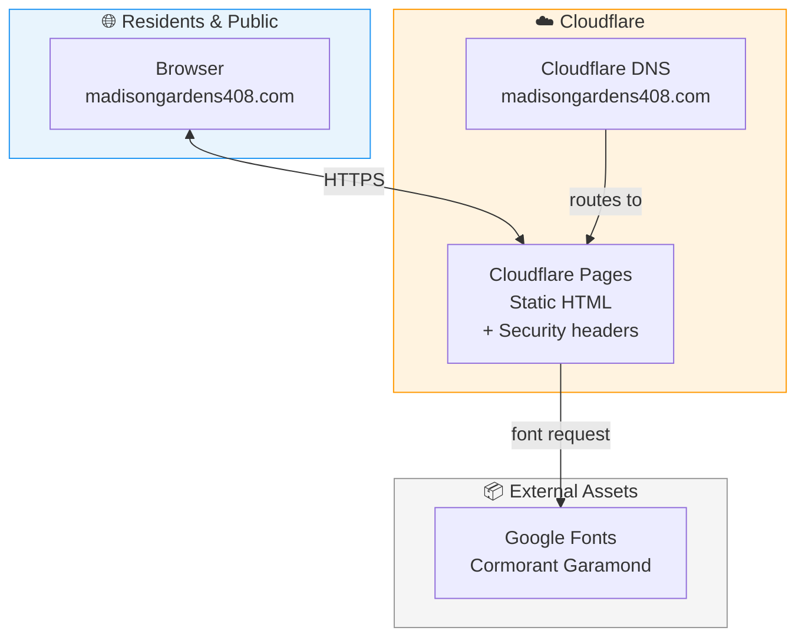
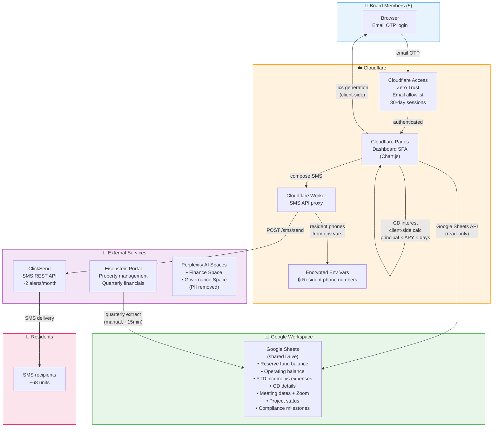

# Co-op Board (Madison Gardens 408) — Data Flow Architecture

> Co-op building website + proposed board dashboard for finances, meetings, and resident communications.

## Platform Summary

| Layer | Service |
|-------|---------|
| **Website Hosting** | Cloudflare Pages (`madisongardens408.com`) |
| **Dashboard Hosting** | Cloudflare Pages (proposed, same infrastructure) |
| **DNS** | Cloudflare |
| **Auth** | Cloudflare Access / Zero Trust (email OTP, 5 board members) |
| **Data Backend** | Google Sheets API (read-only from shared Drive) |
| **Financial Source** | Eisenstein Portal (property management, quarterly extract) |
| **SMS** | ClickSend REST API (via Cloudflare Worker proxy) |
| **AI Knowledge** | Perplexity AI Spaces (Finance + Governance, separate vendor) |
| **Charts** | Chart.js (client-side, CDN) |
| **Analytics** | None |

## Data Flow — Website

## Data Flow — Board Dashboard (Proposed)

## Key Data Flows

1. **Financial Dashboard**: Eisenstein Portal → manual quarterly entry → Google Sheets → Sheets API (read-only) → Dashboard charts (Chart.js)
2. **CD Tracker**: Google Sheets (principal, APY, start date, term) → Dashboard → client-side interest calculation (`principal × APY/365 × days`)
3. **Resident SMS**: Board member composes message → Cloudflare Worker proxy → ClickSend REST API → SMS to residents
4. **Meeting Calendar**: Google Sheets (date, Zoom link, agenda) → Dashboard → .ics file generation (client-side) → Add to Calendar
5. **Auth**: Board member email → Cloudflare Access OTP → 30-day session → audit trail logged

## Cost Impact

| Service | Cost | Notes |
|---------|------|-------|
| Cloudflare Pages | $0 | Free tier |
| Cloudflare Access | $0 | Free tier (≤50 users) |
| Google Sheets API | $0 | Existing workspace |
| ClickSend | Existing | Already in use |
| Eisenstein Portal | Existing | Already in use |
| **Total additional** | **$0** | All on existing services |
